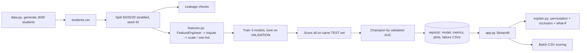

# Architecture and Design Decisions

## Key decisions
1. **Preprocessing is inside the sklearn Pipeline** so training and serving apply identical steps, and no test statistics leak into imputation/scaling.
2. **Robust input handling:** `FeatureEngineer` coerces strings to NaN, clips out-of-range values and adds missing columns; `OneHotEncoder(handle_unknown="ignore")` handles unseen categories. The app cannot crash on messy CSVs.
3. **Champion chosen on validation AUC, never on test**, and all models are scored on the identical test set.
4. **Model-agnostic explanations:** occlusion (swap a feature for the cohort median/mode and measure the probability change) works for any model and yields signed, human-readable factors. Permutation importance gives the global view.
5. **No leakage by construction:** no outcome-derived fields (salary, company); automated check on target-in-features, split overlap and suspiciously high correlation.
6. **Sensitive attributes excluded:** no gender or religion features, to avoid a tool that discriminates.
