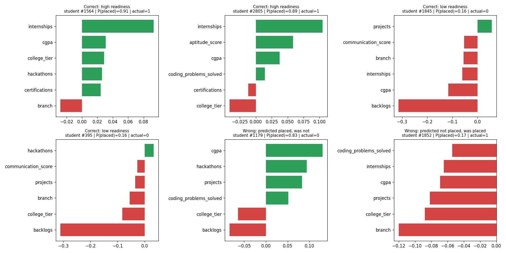

# Individual Prediction Explanations

Impact = change in placement probability versus an average student (positive helps, negative hurts).

## Correct: high readiness - student #1564
- P(placed) = **0.91**, actual = **1**
- Helping: internships=3, cgpa=7.79, college_tier=Tier1, hackathons=1, certifications=3
- Hurting: branch=Mechanical

## Correct: high readiness - student #2805
- P(placed) = **0.89**, actual = **1**
- Helping: internships=3, aptitude_score=72.7, cgpa=7.82, coding_problems_solved=94
- Hurting: college_tier=Tier3, certifications=0

## Correct: low readiness - student #1845
- P(placed) = **0.16**, actual = **0**
- Helping: projects=4
- Hurting: backlogs=2, cgpa=6.14, internships=0, branch=ECE, communication_score=3.7

## Correct: low readiness - student #395
- P(placed) = **0.16**, actual = **0**
- Helping: hackathons=1
- Hurting: backlogs=2, college_tier=Tier3, branch=ECE, projects=1, communication_score=4.7

## Wrong: predicted placed, was not - student #1179
- P(placed) = **0.83**, actual = **0**
- Helping: cgpa=8.45, hackathons=2, projects=4, coding_problems_solved=144
- Hurting: backlogs=1, college_tier=Tier3

## Wrong: predicted not placed, was placed - student #1852
- P(placed) = **0.17**, actual = **1**
- Helping: -
- Hurting: branch=nan, college_tier=Tier3, projects=0, cgpa=6.58, internships=0, coding_problems_solved=4

